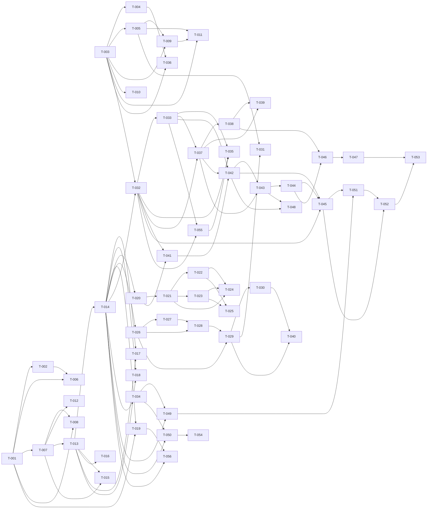

# Build Site

56 tasks across 9 tiers from 8 kits.

---

## Tier 0 — No Dependencies

Tasks in this tier establish foundational primitives: auth registration, token shared primitive, and token budgets. They block everything downstream.

| Task  | Title                                                 | Cavekit       | Req | Effort |
|-------|-------------------------------------------------------|---------------|-----|--------|
| T-001 | User registration endpoint (happy + validation)       | auth          | R1  | M      |
| T-002 | User registration password hashing + duplicate guard  | auth          | R1  | M      |
| T-003 | Centralized agent invocation primitive                | tokens        | R1  | L      |
| T-004 | Per-operation token budgets enforcement               | tokens        | R2  | M      |
| T-005 | Centralized embedding invocation primitive            | tokens        | R3  | M      |

---

## Tier 1 — Depends on Tier 0

Credentialed login, refresh, access-token semantics, rolling counters, prompt cache, and metrics endpoint. All build on Tier 0 primitives.

| Task  | Title                                                | Cavekit | Req | blockedBy | Effort |
|-------|------------------------------------------------------|---------|-----|-----------|--------|
| T-006 | Credentialed login endpoint                          | auth    | R2  | T-001, T-002 | M   |
| T-007 | Access token semantics + TTLs + protected rejection  | auth    | R4  | T-001     | M      |
| T-008 | Refresh token exchange endpoint                      | auth    | R3  | T-001, T-007 | M   |
| T-009 | Per-provider rolling token counters                  | tokens  | R4  | T-003, T-005 | M   |
| T-010 | Prompt cache for non-scoring calls                   | tokens  | R5  | T-003     | M      |
| T-011 | Prometheus metrics endpoint                          | tokens  | R6  | T-003, T-005, T-009 | M |

---

## Tier 2 — Depends on Tier 1

Authenticated user lookup and project creation depend on access-token semantics.

| Task  | Title                                           | Cavekit  | Req | blockedBy | Effort |
|-------|-------------------------------------------------|----------|-----|-----------|--------|
| T-012 | Authenticated user lookup (/me) endpoint        | auth     | R5  | T-007     | M      |
| T-013 | Project creation endpoint + OWNER auto-enroll   | projects | R1  | T-007     | M      |
| T-014 | Role-based membership enum + creator-as-OWNER   | projects | R6  | T-013     | M      |

---

## Tier 3 — Depends on Tier 2

Project listing, retrieval, update, deletion, and member invitation — all depend on project creation + role model.

| Task  | Title                                     | Cavekit  | Req | blockedBy        | Effort |
|-------|-------------------------------------------|----------|-----|------------------|--------|
| T-015 | Project listing scoped to membership      | projects | R2  | T-013, T-007     | M      |
| T-016 | Project retrieval with 404-for-non-member | projects | R3  | T-013            | M      |
| T-017 | Project PATCH update with role gating     | projects | R4  | T-013, T-014     | M      |
| T-018 | Project DELETE (OWNER-only) + cascades    | projects | R5  | T-013, T-014     | M      |
| T-019 | Member invitation endpoint (OWNER-only)   | projects | R7  | T-014, T-001     | M      |

---

## Tier 4 — Depends on Tier 3

Profile CRUD, knowledge-item CRUD, and owner-role escalation guard depend on project membership model.

| Task  | Title                                                 | Cavekit   | Req | blockedBy        | Effort |
|-------|-------------------------------------------------------|-----------|-----|------------------|--------|
| T-056 | Owner role escalation guard (MEMBER can't grant OWNER, last OWNER protected) | approvals | R7 | T-014, T-019 | M |
| T-020 | Profile retrieval endpoint                            | profile   | R1  | T-014            | M      |
| T-021 | Profile Tier 1 required-field validation              | profile   | R2  | T-020            | M      |
| T-022 | Profile Tier 2 recommended-field validation           | profile   | R3  | T-021            | M      |
| T-023 | Profile Tier 3 optional-field validation              | profile   | R4  | T-021            | M      |
| T-024 | Profile full-replacement PUT with role gating         | profile   | R5  | T-021, T-022, T-023 | M   |
| T-025 | Profile partial-update PATCH                          | profile   | R6  | T-022, T-023     | M      |
| T-026 | Knowledge item creation (async embedding)             | knowledge | R1  | T-014            | M      |
| T-027 | Knowledge item listing scoped to project              | knowledge | R2  | T-026            | S      |

---

## Tier 5 — Depends on Tier 4

Knowledge isolation, semantic search, retrieval budgets, and embedding cache. Tasks-domain base (creation + scoring) and task listing begin here.

| Task  | Title                                               | Cavekit   | Req | blockedBy               | Effort |
|-------|-----------------------------------------------------|-----------|-----|-------------------------|--------|
| T-028 | Knowledge project isolation on all reads/search     | knowledge | R3  | T-026, T-027            | M      |
| T-029 | Semantic search endpoint (q/filter/limit/auth)      | knowledge | R4  | T-026, T-028            | L      |
| T-030 | Retrieval budget enforcement (chunk/total/minSim)   | knowledge | R5  | T-029                   | L      |
| T-031 | Embedding cache for search (miss/hit/write)         | knowledge | R6  | T-029, T-005            | M      |
| T-032 | Task creation + scoring (input validation + zones)  | tasks     | R1  | T-014, T-003            | L      |
| T-033 | Scoring zone persistence on task record             | tasks     | R2  | T-032                   | M      |
| T-034 | Task listing (paginated) + get-by-id                | tasks     | R4  | T-014                   | M      |

---

## Tier 6 — Depends on Tier 5

Clarification loop, scoring clarificationQuestions fix, execution intake, scenario definitions, structured handoff, RAG reuse, profile execution guard.

| Task  | Title                                                 | Cavekit       | Req | blockedBy               | Effort |
|-------|-------------------------------------------------------|---------------|-----|-------------------------|--------|
| T-055 | Scoring service emits clarificationQuestions when score 25-39 | tasks | R9  | T-032, T-033        | M      |
| T-035 | Clarification round endpoint (answer → re-score)      | tasks         | R3  | T-032, T-033, T-055  | L      |
| T-036 | Agent invocation proxy (token guard, 429, telemetry)  | orchestration | R2  | T-003, T-004            | M      |
| T-037 | Execution intake + payload contract                   | orchestration | R1  | T-032, T-033            | M      |
| T-038 | Scenario A/B/C/D definitions dispatch                 | orchestration | R5  | T-037                   | L      |
| T-039 | Structured agent handoff (JSON for B and D)           | orchestration | R8  | T-037, T-038            | M      |
| T-040 | RAG reuse within execution (single search + pack)     | orchestration | R7  | T-029, T-030            | M      |
| T-041 | Profile prerequisite for task execution               | profile       | R7  | T-020, T-032            | S      |

---

## Tier 7 — Depends on Tier 6

Execution trigger, step callback, execution completion, iterative evaluation, review flag, SSE stream, approvals history and decision.

| Task  | Title                                                | Cavekit       | Req | blockedBy                      | Effort |
|-------|------------------------------------------------------|---------------|-----|--------------------------------|--------|
| T-042 | Task execution trigger + outbound payload            | tasks         | R5  | T-033, T-041, T-037            | L      |
| T-043 | Step callback endpoint (persist + SSE + errors)      | orchestration | R3  | T-037, T-042                   | M      |
| T-044 | Execution completion callback + status transition    | orchestration | R4  | T-043                          | M      |
| T-045 | Task status machine transitions                      | tasks         | R6  | T-032, T-042, T-044            | M      |
| T-046 | Iterative evaluation loop (Scenario D, max 3)        | orchestration | R6  | T-044, T-038                   | L      |
| T-047 | Review-required flag propagation                     | tasks         | R7  | T-046                          | S      |
| T-048 | Live execution SSE stream endpoint                   | tasks         | R8  | T-042, T-043                   | M      |
| T-049 | Approval history endpoint                            | approvals     | R1  | T-014, T-034                   | M      |
| T-050 | Agent feedback listing endpoint                      | approvals     | R5  | T-014, T-034                   | M      |

---

## Tier 8 — Depends on Tier 7

Approval decision, decision effects, revision cap, feedback submission.

| Task  | Title                                              | Cavekit   | Req | blockedBy        | Effort |
|-------|----------------------------------------------------|-----------|-----|------------------|--------|
| T-051 | Approval decision endpoint (validation + state)    | approvals | R2  | T-049, T-045     | M      |
| T-052 | Decision effects on task status                    | approvals | R3  | T-051, T-045     | M      |
| T-053 | Revision cap (3 allowed, 4th → requiresReview)     | approvals | R4  | T-052, T-047     | M      |
| T-054 | Agent feedback submission endpoint                 | approvals | R6  | T-050            | M      |

---

## Summary

| Tier | Tasks | Effort breakdown           |
|------|-------|----------------------------|
| 0    | 5     | 1 L, 4 M                   |
| 1    | 6     | 6 M                        |
| 2    | 3     | 3 M                        |
| 3    | 5     | 5 M                        |
| 4    | 9     | 8 M, 1 S                   |
| 5    | 7     | 3 L, 4 M                   |
| 6    | 8     | 2 L, 5 M, 1 S              |
| 7    | 9     | 2 L, 6 M, 1 S              |
| 8    | 4     | 4 M                        |

**Total: 56 tasks, 9 tiers (Tier 0 through Tier 8)**

Note: T-001…T-054 original tasks; T-055 (tasks R9) and T-056 (approvals R7) added post-/ck:check.

---

## Coverage Matrix

Each non-GAP acceptance criterion from every requirement appears exactly once, mapped to the task(s) responsible.

### cavekit-auth

| Cavekit | Req | Criterion (abbreviated)                                       | Task(s)        | Status  |
|---------|-----|---------------------------------------------------------------|----------------|---------|
| auth    | R1  | Valid register → 201 + tokens + user                          | T-001          | Covered |
| auth    | R1  | Duplicate email → 409                                         | T-002          | Covered |
| auth    | R1  | Missing/invalid email or password <8 → 400                    | T-001          | Covered |
| auth    | R1  | Password stored as hash, never plaintext                      | T-002          | Covered |
| auth    | R2  | Valid login → 200 + tokens + user                             | T-006          | Covered |
| auth    | R2  | Unknown email → 401                                           | T-006          | Covered |
| auth    | R2  | Wrong password → 401                                          | T-006          | Covered |
| auth    | R2  | Unknown-email and wrong-password responses indistinguishable  | T-006          | Covered |
| auth    | R3  | Valid refresh → 200 + new pair                                | T-008          | Covered |
| auth    | R3  | Access token used as refresh → 401                            | T-008          | Covered |
| auth    | R3  | Malformed/tampered token → 401                                | T-008          | Covered |
| auth    | R3  | Refresh token whose user no longer exists → 401               | T-008          | Covered |
| auth    | R4  | Access TTL = 15 minutes                                       | T-007          | Covered |
| auth    | R4  | Refresh TTL = 7 days                                          | T-007          | Covered |
| auth    | R4  | Protected endpoint with refresh token → 401                   | T-007          | Covered |
| auth    | R4  | Protected endpoint with expired access token → 401            | T-007          | Covered |
| auth    | R4  | Protected endpoint with no token → 401                        | T-007          | Covered |
| auth    | R5  | Valid access → 200 + user (id, email, name, createdAt, ev)    | T-012          | Covered |
| auth    | R5  | No token → 401                                                | T-012          | Covered |
| auth    | R5  | Refresh token → 401                                           | T-012          | Covered |
| auth    | R5  | Valid token, user deleted → 404                               | T-012          | Covered |

### cavekit-tokens

| Cavekit | Req | Criterion (abbreviated)                                        | Task(s)        | Status  |
|---------|-----|----------------------------------------------------------------|----------------|---------|
| tokens  | R1  | Direct LLM call without shared primitive = violation           | T-003          | Covered |
| tokens  | R1  | Over-budget call raises TokenLimitExceededError pre-provider   | T-003          | Covered |
| tokens  | R1  | Successful call writes usage to Billing model                  | T-003          | Covered |
| tokens  | R1  | Successful call writes telemetry (taskId, scenario, etc.)      | T-003          | Covered |
| tokens  | R2  | scoring → MAX_TOKENS_SCORING                                   | T-004          | Covered |
| tokens  | R2  | evaluator JSON → MAX_TOKENS_EVALUATOR_JSON                     | T-004          | Covered |
| tokens  | R2  | marketer brief → MAX_TOKENS_MARKETER_BRIEF                     | T-004          | Covered |
| tokens  | R2  | content generation → MAX_TOKENS_CONTENT_GENERATION             | T-004          | Covered |
| tokens  | R2  | revision delta → MAX_TOKENS_REVISION_DELTA                     | T-004          | Covered |
| tokens  | R3  | Direct embedding call without shared primitive = violation     | T-005          | Covered |
| tokens  | R3  | Cache lookup before every outbound embedding; hit = no call    | T-005          | Covered |
| tokens  | R3  | Embedding call over budget rejected before provider            | T-005          | Covered |
| tokens  | R3  | Single-text and batch both route through shared primitive      | T-005          | Covered |
| tokens  | R4  | tokens_used:claude incremented after each Claude call          | T-009          | Covered |
| tokens  | R4  | tokens_used:voyage incremented after each Voyage call          | T-009          | Covered |
| tokens  | R4  | Window controlled by TOKEN_LIMIT_WINDOW_SECONDS                | T-009          | Covered |
| tokens  | R4  | Entries outside window excluded from current total             | T-009          | Covered |
| tokens  | R5  | Scoring calls do NOT use prompt cache                          | T-010          | Covered |
| tokens  | R5  | Non-scoring agent calls use prompt cache                       | T-010          | Covered |
| tokens  | R5  | cacheCreationTokens + cacheReadTokens captured per call        | T-010          | Covered |
| tokens  | R6  | GET /metrics → 200, text/plain, Prometheus format              | T-011          | Covered |
| tokens  | R6  | Response includes per-provider token counters                  | T-011          | Covered |
| tokens  | R6  | Response includes per-step telemetry samples                   | T-011          | Covered |

### cavekit-projects

| Cavekit  | Req | Criterion (abbreviated)                                     | Task(s)      | Status  |
|----------|-----|-------------------------------------------------------------|--------------|---------|
| projects | R1  | Valid create → 201 + project{id,name,settings,ownerId}      | T-013        | Covered |
| projects | R1  | Creator auto-enrolled as OWNER                              | T-013        | Covered |
| projects | R1  | Unauthenticated → 401                                       | T-013        | Covered |
| projects | R1  | settings accepts optional language/defaultScenario          | T-013        | Covered |
| projects | R2  | List contains every project where caller is member          | T-015        | Covered |
| projects | R2  | List excludes projects with no membership                   | T-015        | Covered |
| projects | R2  | Unauthenticated → 401                                       | T-015        | Covered |
| projects | R3  | Member GET → 200 + project                                  | T-016        | Covered |
| projects | R3  | Non-member GET → 404 (never 403)                            | T-016        | Covered |
| projects | R3  | Non-existent id → 404                                       | T-016        | Covered |
| projects | R3  | Unauthenticated → 401                                       | T-016        | Covered |
| projects | R4  | PATCH from OWNER or MEMBER → 200 + updated                  | T-017        | Covered |
| projects | R4  | PATCH from non-member → 404                                 | T-017        | Covered |
| projects | R4  | PATCH unauthenticated → 401                                 | T-017        | Covered |
| projects | R5  | DELETE from OWNER → success + removed                       | T-018        | Covered |
| projects | R5  | DELETE from MEMBER or VIEWER → rejected                     | T-018        | Covered |
| projects | R5  | DELETE from non-member → 404                                | T-018        | Covered |
| projects | R6  | Creator recorded as OWNER on create                         | T-014        | Covered |
| projects | R6  | Role ∈ {OWNER,MEMBER,VIEWER}; other values rejected         | T-014        | Covered |
| projects | R6  | User without membership = non-member for all ops            | T-014        | Covered |
| projects | R7  | OWNER POST /members {email,role} → success + record         | T-019        | Covered |
| projects | R7  | Unknown email → explicit error, not silent success          | T-019        | Covered |
| projects | R7  | MEMBER or VIEWER POST /members → rejected                   | T-019        | Covered |

### cavekit-profile

| Cavekit | Req | Criterion (abbreviated)                                       | Task(s)       | Status  |
|---------|-----|---------------------------------------------------------------|---------------|---------|
| profile | R1  | Member → 200 + stored profile                                 | T-020         | Covered |
| profile | R1  | Member, no profile → 404 + distinguishable error code         | T-020         | Covered |
| profile | R1  | Non-member → 404, no existence leak                           | T-020         | Covered |
| profile | R1  | Unauthenticated → 401                                         | T-020         | Covered |
| profile | R2  | PUT missing Tier 1 field → 400                                | T-021         | Covered |
| profile | R2  | companyName max 200                                           | T-021         | Covered |
| profile | R2  | description min 10, max 2000                                  | T-021         | Covered |
| profile | R2  | niche max 200                                                 | T-021         | Covered |
| profile | R2  | geography max 200, default "Russia"                           | T-021         | Covered |
| profile | R3  | Tier 2 fields accepted on write                               | T-022         | Covered |
| profile | R3  | tov only accepts ToneOfVoice enum; other → 400                | T-022         | Covered |
| profile | R3  | competitor without name rejected                              | T-022         | Covered |
| profile | R3  | reference without url or description rejected                 | T-022         | Covered |
| profile | R4  | Tier 3 fields accepted when supplied                          | T-023         | Covered |
| profile | R4  | existingContent max 5000                                      | T-023         | Covered |
| profile | R4  | Omitting all Tier 3 permitted on PUT and PATCH                | T-023         | Covered |
| profile | R5  | PUT OWNER/MEMBER + valid Tier 1 → 200                         | T-024         | Covered |
| profile | R5  | PUT from VIEWER → rejected                                    | T-024         | Covered |
| profile | R5  | PUT from non-member → 404                                     | T-024         | Covered |
| profile | R5  | PUT with Tier 1 violation → 400, no data written              | T-024         | Covered |
| profile | R6  | PATCH subset → 200, other fields unchanged                    | T-025         | Covered |
| profile | R6  | PATCH from VIEWER → rejected                                  | T-025         | Covered |
| profile | R6  | PATCH with constraint violation → 400                         | T-025         | Covered |
| profile | R7  | Execute task with no profile → PROFILE_MISSING                | T-041         | Covered |
| profile | R7  | Check applies even if task already created and scored         | T-041         | Covered |

### cavekit-knowledge

| Cavekit   | Req | Criterion (abbreviated)                                    | Task(s)       | Status  |
|-----------|-----|------------------------------------------------------------|---------------|---------|
| knowledge | R1  | Member + valid category + non-empty → success              | T-026         | Covered |
| knowledge | R1  | Invalid category → 400                                     | T-026         | Covered |
| knowledge | R1  | Non-member → 404                                           | T-026         | Covered |
| knowledge | R1  | Item persisted immediately; embedding async, non-blocking  | T-026         | Covered |
| knowledge | R1  | Embedding failure does not fail or delete item             | T-026         | Covered |
| knowledge | R2  | Member → items with matching project_id                    | T-027         | Covered |
| knowledge | R2  | Non-member → 404                                           | T-027         | Covered |
| knowledge | R2  | Items from other projects never appear                     | T-027         | Covered |
| knowledge | R3  | Every read/search filters by project_id                    | T-028         | Covered |
| knowledge | R3  | Item in project A never returned for project B             | T-028         | Covered |
| knowledge | R4  | q 1-500 → 200 {data, shortlist, promptPack}                | T-029         | Covered |
| knowledge | R4  | q missing/empty/>500 → 400                                 | T-029         | Covered |
| knowledge | R4  | Optional category filter restricts results                 | T-029         | Covered |
| knowledge | R4  | limit 1-20 default 5; out of range → 400                   | T-029         | Covered |
| knowledge | R4  | Non-member → 404                                           | T-029         | Covered |
| knowledge | R4  | Injection-style category → 400, never reaches DB           | T-029         | Covered |
| knowledge | R5  | maxCharsPerChunk 100-5000, default 1200                    | T-030         | Covered |
| knowledge | R5  | maxTotalChars 500-20000, default 4000                      | T-030         | Covered |
| knowledge | R5  | minSimilarity 0-1, default 0.72                            | T-030         | Covered |
| knowledge | R5  | Out-of-range budget params → 400                           | T-030         | Covered |
| knowledge | R5  | promptPack concatenates shortlist within maxTotalChars     | T-030         | Covered |
| knowledge | R6  | Repeated identical search within TTL → no extra call       | T-031         | Covered |
| knowledge | R6  | Cache miss → compute + write to cache                      | T-031         | Covered |
| knowledge | R6  | Cache lookup before every outbound embedding call          | T-031         | Covered |

### cavekit-tasks

| Cavekit | Req | Criterion (abbreviated)                                      | Task(s)       | Status  |
|---------|-----|--------------------------------------------------------------|---------------|---------|
| tasks   | R1  | input 10-5000 → scored task                                  | T-032         | Covered |
| tasks   | R1  | input <10 or >5000 → 400                                     | T-032         | Covered |
| tasks   | R1  | score <25 → REJECTED, 422, TASK_SCORE_TOO_LOW                | T-032         | Covered |
| tasks   | R1  | score 25-39 → AWAITING_CLARIFICATION, 202, questions         | T-032         | Covered |
| tasks   | R1  | score ≥40 → PENDING, 201, score+scenario                     | T-032         | Covered |
| tasks   | R1  | Non-member → 404                                             | T-032         | Covered |
| tasks   | R2  | 0-24 → REJECTED                                              | T-033         | Covered |
| tasks   | R2  | 25-39 → AWAITING_CLARIFICATION                               | T-033         | Covered |
| tasks   | R2  | 40-100 → PENDING                                             | T-033         | Covered |
| tasks   | R2  | Scored result stored on task record                          | T-033         | Covered |
| tasks   | R3  | POST {answer} → appends answer + re-scores                   | T-035         | Covered |
| tasks   | R3  | New score <25 → REJECTED + TASK_SCORE_TOO_LOW                | T-035         | Covered |
| tasks   | R3  | New 25-39 → AWAITING_CLARIFICATION + new questions           | T-035         | Covered |
| tasks   | R3  | New ≥40 → PENDING + scenario                                 | T-035         | Covered |
| tasks   | R3  | Task not AWAITING_CLARIFICATION → 404                        | T-035         | Covered |
| tasks   | R3  | Non-member → 404                                             | T-035         | Covered |
| tasks   | R4  | List returns tasks scoped to addressed project only          | T-034         | Covered |
| tasks   | R4  | List is paginated                                            | T-034         | Covered |
| tasks   | R4  | Get by id → 200 to member                                    | T-034         | Covered |
| tasks   | R4  | Get by id → 404 to non-member                                | T-034         | Covered |
| tasks   | R5  | Execute on PENDING → 202, QUEUED                             | T-042         | Covered |
| tasks   | R5  | No project profile → PROFILE_MISSING                         | T-042         | Covered |
| tasks   | R5  | Execute on non-PENDING → error                               | T-042         | Covered |
| tasks   | R5  | Payload includes taskId, projectId, scenario, input, score, projectProfile | T-042 | Covered |
| tasks   | R6  | Transitions PENDING→QUEUED→RUNNING→AWAITING_APPROVAL→COMPLETED / FAILED | T-045 | Covered |
| tasks   | R6  | AWAITING_CLARIFICATION → PENDING, REJECTED, or stay          | T-045         | Covered |
| tasks   | R6  | REJECTED is terminal                                         | T-045         | Covered |
| tasks   | R7  | iterationsFailed=true → requiresReview=true                  | T-047         | Covered |
| tasks   | R7  | iterationsFailed=false → requiresReview=false                | T-047         | Covered |
| tasks   | R8  | Valid token → SSE stream of agent.output                     | T-048         | Covered |
| tasks   | R8  | Stream emits execution.failed / execution.complete           | T-048         | Covered |
| tasks   | R8  | No auth → 401                                                | T-048         | Covered |
| tasks   | R8  | Non-member → 404                                             | T-048         | Covered |
| tasks   | R9  | Score 25-39: scoring result contains non-empty clarificationQuestions | T-055  | Covered |
| tasks   | R9  | HTTP 202 body for AWAITING_CLARIFICATION has ≥1 clarificationQuestion | T-055  | Covered |
| tasks   | R9  | clarificationNote on task derived from clarificationQuestions, not empty | T-055 | Covered |

### cavekit-orchestration

| Cavekit       | Req | Criterion (abbreviated)                                     | Task(s)       | Status  |
|---------------|-----|-------------------------------------------------------------|---------------|---------|
| orchestration | R1  | Payload to workflow engine contains exec/task/project/etc.  | T-037         | Covered |
| orchestration | R1  | Execution record created and linked before outbound         | T-037         | Covered |
| orchestration | R1  | callbackUrl in payload is the one engine must use           | T-037         | Covered |
| orchestration | R2  | Calls without valid internal API token → rejected           | T-036         | Covered |
| orchestration | R2  | Calls exceeding per-op budget → 429                         | T-036         | Covered |
| orchestration | R2  | Successful call writes usage + telemetry                    | T-036         | Covered |
| orchestration | R3  | Valid callback persists AgentOutput                         | T-043         | Covered |
| orchestration | R3  | Valid callback emits agent.output SSE                       | T-043         | Covered |
| orchestration | R3  | Failure callback emits execution.failed SSE                 | T-043         | Covered |
| orchestration | R3  | Unknown executionId → 404                                   | T-043         | Covered |
| orchestration | R3  | Malformed payload → 400                                     | T-043         | Covered |
| orchestration | R4  | Completion → task AWAITING_APPROVAL                         | T-044         | Covered |
| orchestration | R4  | iterationsFailed=true → requiresReview=true                 | T-044         | Covered |
| orchestration | R4  | Emits execution.complete SSE                                | T-044         | Covered |
| orchestration | R4  | Unknown executionId → 404                                   | T-044         | Covered |
| orchestration | R5  | Scenario A: single agent end-to-end                         | T-038         | Covered |
| orchestration | R5  | Scenario B: marketer→content_maker JSON brief               | T-038         | Covered |
| orchestration | R5  | Scenario C: multi-agent parallel + merged                   | T-038         | Covered |
| orchestration | R5  | Scenario D: marketer→content_maker→evaluator max 3 iter     | T-038         | Covered |
| orchestration | R6  | Evaluator returns {pass, score 0-100, feedback}             | T-046         | Covered |
| orchestration | R6  | pass=false + iterations<3 → re-run with revision delta      | T-046         | Covered |
| orchestration | R6  | iterations=3 without pass → iterationsFailed=true           | T-046         | Covered |
| orchestration | R7  | One semantic search per execution                           | T-040         | Covered |
| orchestration | R7  | Prompt pack passed to every agent call within execution     | T-040         | Covered |
| orchestration | R7  | No additional search between iterations                     | T-040         | Covered |
| orchestration | R8  | Scenario B: content_maker receives JSON                     | T-039         | Covered |
| orchestration | R8  | Scenario D: content_maker receives JSON                     | T-039         | Covered |
| orchestration | R8  | Freeform-only handoff = violation                           | T-039         | Covered |

### cavekit-approvals

| Cavekit   | Req | Criterion (abbreviated)                                   | Task(s)       | Status  |
|-----------|-----|-----------------------------------------------------------|---------------|---------|
| approvals | R1  | Member → chronological list of approvals                  | T-049         | Covered |
| approvals | R1  | Non-member → 404                                          | T-049         | Covered |
| approvals | R2  | Decision + optional comment on AWAITING_APPROVAL accepted | T-051         | Covered |
| approvals | R2  | decision ∈ {APPROVE,REJECT,REVISION_REQUESTED}; else 400  | T-051         | Covered |
| approvals | R2  | comment >2000 → 400                                       | T-051         | Covered |
| approvals | R2  | Task not AWAITING_APPROVAL → error                        | T-051         | Covered |
| approvals | R2  | Non-member → 404                                          | T-051         | Covered |
| approvals | R3  | APPROVE → COMPLETED                                       | T-052         | Covered |
| approvals | R3  | REJECT → FAILED                                           | T-052         | Covered |
| approvals | R3  | REVISION_REQUESTED → re-queued + counter incremented      | T-052         | Covered |
| approvals | R4  | REVISION_REQUESTED accepted up to 3 times                 | T-053         | Covered |
| approvals | R4  | 4th REVISION_REQUESTED → requiresReview=true              | T-053         | Covered |
| approvals | R5  | Member → all feedback records for task                    | T-050         | Covered |
| approvals | R5  | Non-member → 404                                          | T-050         | Covered |
| approvals | R6  | agentType + score accepted                                | T-054         | Covered |
| approvals | R6  | agentType ∈ {MARKETER,CONTENT_MAKER,EVALUATOR}; else 400  | T-054         | Covered |
| approvals | R6  | score ∈ {1..5}; else 400                                  | T-054         | Covered |
| approvals | R6  | comment optional                                          | T-054         | Covered |
| approvals | R6  | Multiple records for same task + different agentType ok   | T-054         | Covered |
| approvals | R7  | MEMBER attempting to grant OWNER role → 403               | T-056         | Covered |
| approvals | R7  | Demotion/removal of last OWNER → 422                      | T-056         | Covered |

**Coverage: 163/163 criteria (100%)**

---

## Dependency Graph

