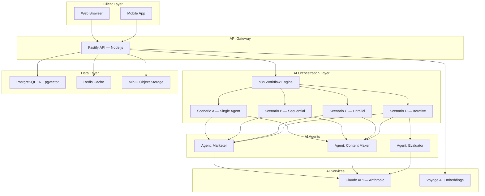
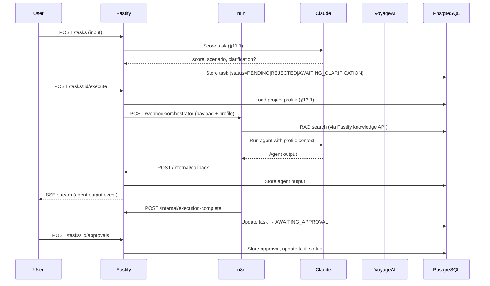
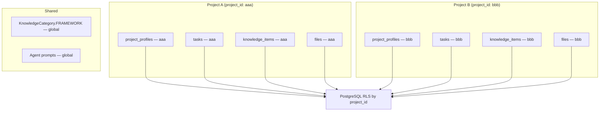
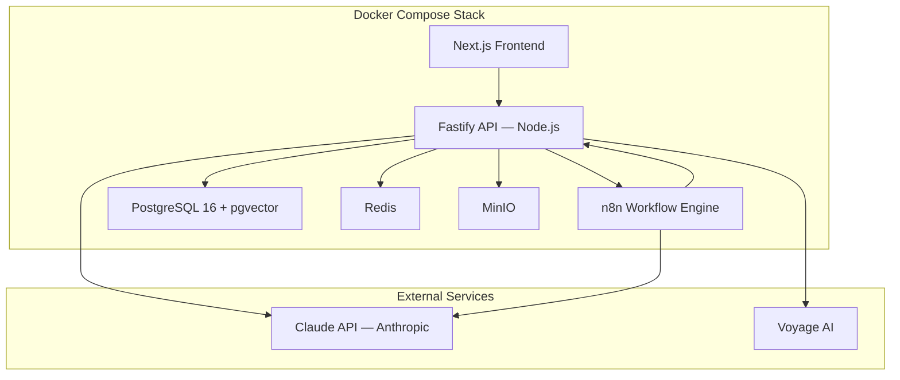

# Architecture Overview

## System Architecture



## Component Descriptions

### Module Contracts
- Modules interact through public contracts: interfaces, TypeScript types, Zod schemas, and explicit DTOs.
- When implementing a module, only that module's implementation is in context; dependent modules are represented only by their contracts (`*.interface.ts`, `types.ts`, Zod schemas).
- This preserves encapsulation, reduces context window usage, and protects internal module logic from unrequested changes.

### Frontend Layer
- **Next.js 14** with App Router
- **Tailwind CSS** + **shadcn/ui** for styling
- **TypeScript** for type safety
- Handles authentication, project management, task creation, SSE streaming, approval flows

### API Gateway (`apps/api`)
- **Fastify** (Node.js) for high-performance async HTTP API
- **Zod** for request validation
- **JWT** authentication with access + refresh tokens
- **SSE** (Server-Sent Events) for real-time agent progress streaming
- Routes: `/api/auth`, `/api/projects`, `/api/projects/:id/profile`, `/api/projects/:id/tasks`, `/api/projects/:id/tasks/:id/approvals`, `/api/projects/:id/tasks/:id/feedback`, `/api/projects/:id/knowledge`, `/api/internal/callback`

### AI Orchestration Layer (`apps/workflows`)
- **n8n** as workflow engine — scenarios are version-controlled TypeScript files (`apps/workflows/`)
- **Scenario A** — single agent routing (Marketer or Content Maker based on task classification)
- **Scenario B** — sequential: Marketer → Content Maker with strict JSON handoff (`docs/agent_protocol.md`)
- **Scenario C** — parallel: Marketer and Content Maker run simultaneously, results merged
- **Scenario D** — iterative: Marketer → Content Maker → Evaluator loop (max 3 iterations, then manager escalation per §11.4 ТЗ)
- n8n calls back to Fastify `/api/internal/callback` after each agent step
- Agent tools (RAG search, knowledge base) are called via HTTP from n8n Code nodes

### AI Services
- **claude-sonnet-4-6** for reasoning, strategy, content generation, and evaluation
- **Voyage AI** for semantic embeddings (1024 dimensions) stored in pgvector
- **Redis embedding cache** for repeated Voyage AI vectors and token savings
- Fallback: agent errors are caught in n8n and reported back via callback

### Data Layer
- **PostgreSQL 16** with **pgvector** for vector similarity search (RAG)
- **Redis** for caching and n8n queue backend (`EXECUTIONS_MODE=queue`)
- **MinIO** for file storage: brand assets, task uploads, generated outputs
- **Row Level Security (RLS)** enforces multi-tenant isolation by `project_id`

### Task Lifecycle (§11.1–§11.5 ТЗ)
```
PENDING → [score < 25] → REJECTED
PENDING → [25-39]      → AWAITING_CLARIFICATION → (client answers) → re-score
PENDING → [≥ 40]       → QUEUED → RUNNING → AWAITING_APPROVAL → COMPLETED
                                                               → REVISION_REQUESTED (up to 3×) → QUEUED
                                                               → REJECTED
```

## Data Flow



## Multi-Tenancy Architecture



## Security Architecture

- **Authentication**: JWT (access + refresh tokens, RS256)
- **Authorization**: Role-based (`PlatformRole`: SUPER_ADMIN, MANAGER, USER; `MemberRole`: OWNER, MEMBER, VIEWER)
- **Data Isolation**: PostgreSQL RLS policies keyed by `project_id`
- **API Security**: Zod validation on all inputs, rate limiting via Fastify plugin
- **Internal callbacks**: `INTERNAL_API_TOKEN` header required on `/api/internal/*`
- **Secrets**: Environment variables only — never committed

## Deployment Architecture



## Key Design Decisions

| Decision | Choice | Reason |
|---|---|---|
| API runtime | Node.js + Fastify | TypeScript monorepo, SSE native support, shared types with frontend |
| Orchestration | n8n (not CrewAI/LangChain) | Visual debugging, webhook-native, version-controlled as code |
| Agent intelligence | Claude API direct | No abstraction layer needed — direct HTTP in n8n Code nodes |
| Queue backend | Redis + n8n queue mode | Avoids Celery/Python dependency |
| File storage | MinIO | S3-compatible, self-hosted, Docker-friendly |
| Embeddings | Voyage AI 1024-dim | Best Russian-language semantic search quality |
| Multi-tenancy | PostgreSQL RLS | Row-level isolation without application-layer filtering |

## Performance Considerations

- **Async/Await**: All Fastify routes are async; database uses connection pooling via Prisma
- **SSE**: Long-lived connections managed with `Map<taskId, senderFn>` in-process registry
- **Vector Search**: pgvector with HNSW indexing for fast approximate nearest-neighbor lookup
- **RAG Budget**: knowledge search trims context with `maxCharsPerChunk`, `maxTotalChars`, and `minSimilarity` before prompt injection
- **n8n Queue Mode**: Redis-backed execution queue allows horizontal n8n worker scaling
- **Caching**: Redis for session tokens and frequently-read project profiles

## Token Monitoring

AI token usage is measured in `packages/ai-engine` at the provider boundary.

- Claude calls read token usage from Anthropic API responses and increment Redis counters under `tokens_used:claude`.
- Voyage AI embedding calls read token usage from Voyage responses when available; otherwise they use the local text-token estimate and increment `tokens_used:voyage`.
- Redis also stores fallback counters under `token_fallbacks:claude` and `token_fallbacks:voyage`.
- Every monitored agent step writes telemetry to `agent_step_telemetry` and `agent_step_telemetry:{taskId}` with `taskId`, `scenario`, input/output tokens, RAG chars/tokens, model, latency, and cost estimate.
- The Fastify API exposes Prometheus text metrics at `GET /metrics`:
  - `ai_tokens_used_total{provider="claude|voyage"}`
  - `ai_tokens_used_by_operation_total{provider="claude|voyage",operation="..."}`
  - `ai_token_limit{provider="claude|voyage"}`
  - `ai_token_fallbacks_total{provider="claude|voyage"}`
  - `ai_token_cost_estimate_usd_total{provider="claude|voyage"}`
- Runtime limits are configured with `CLAUDE_TOKEN_LIMIT` and `VOYAGE_TOKEN_LIMIT`; set a limit to `0` to disable enforcement for that provider.
- Cost estimates use deployment-configured rates: `CLAUDE_INPUT_COST_PER_MTOKENS` and `CLAUDE_OUTPUT_COST_PER_MTOKENS`.
- Claude output budgets are task-specific, not a shared global value:
  - scoring: `MAX_TOKENS_SCORING` (default 512; target 300-600)
  - evaluator JSON: `MAX_TOKENS_EVALUATOR_JSON` (default 1024; target 800-1500)
  - marketer brief: `MAX_TOKENS_MARKETER_BRIEF` (default 2400; target 1500-3000)
  - content generation: `MAX_TOKENS_CONTENT_GENERATION` (default 4096; tune by deliverable)
  - revision delta: `MAX_TOKENS_REVISION_DELTA` (default 1500; target 800-2000)
- When a limit would be exceeded, agents stop making new provider calls. Claude falls back to a cached response for the same prompt when available. Voyage embeddings use the Redis embedding cache first and refuse uncached calls after the limit is reached.
- n8n workflows must call `POST /api/internal/agent-completion` for Claude completions instead of calling `api.anthropic.com` directly; direct provider calls bypass token counters and limits.
- Prometheus should scrape `/metrics` on the API service and alert when `ai_tokens_used_total / ai_token_limit` crosses 80%, 90%, and 100%.
- Dashboards should also group `ai_tokens_used_by_operation_total` by `operation` to surface the most expensive flows such as `scenario-b.marketer`, `scenario-d.content_maker`, `scenario-d.evaluator`, and `task.scoring`.
